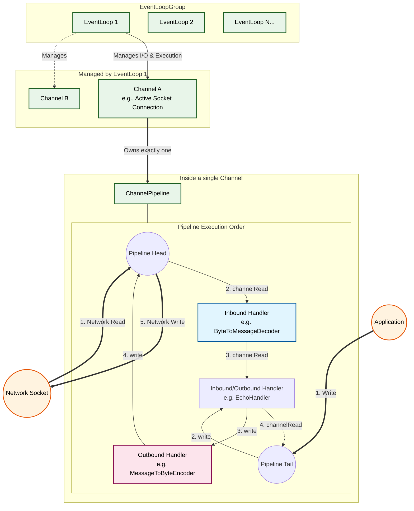

# SwiftNIO Architectural Overview

SwiftNIO is a cross-platform asynchronous event-driven network application framework. Its architecture is built around several core primitives that work together to handle non-blocking I/O.

## Core Concepts

1. **`EventLoopGroup` & `EventLoop`**:
   - An **EventLoop** is a single thread running an infinite loop, constantly checking for I/O events (like new connections or incoming data) using the system's kernel (like `kqueue` on macOS or `epoll` on Linux). 
   - An **EventLoopGroup** manages a pool of these loops (typically one per CPU core). When a new connection arrives, it assigns the connection to exactly one `EventLoop`.

2. **`Channel`**:
   - A `Channel` represents a network socket (a TCP connection, for example). 
   - **Crucial Rule:** A `Channel` is bound to a single `EventLoop` for its entire lifetime. This means all processing for a given connection happens on the exact same thread, avoiding the need for locks and mutexes.

3. **`ChannelPipeline`**:
   - Every `Channel` has one `ChannelPipeline`. Think of it as a conveyor belt that data rides on when moving between the Network and your Application.

4. **`ChannelHandler`**:
   - The building blocks on the pipeline. You write these to handle your specific protocol.
   - **Inbound Handlers:** Process data moving from the network to the application (parsing raw bytes into swift structs, handling connections). Events flow from **Head to Tail**.
   - **Outbound Handlers:** Process data moving from the application to the network (encoding swift structs back into raw bytes). Events flow from **Tail to Head**.

## Architecture Diagram

